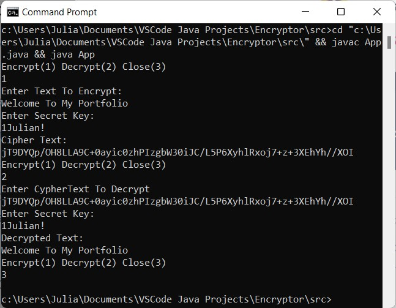

## Java Encryptor

This JAVA console application encrypts and decrypts text/cyphertext inputted by the user using the AES algorithm.

## Operation
<ul>
<li>
User selects either encryption or decryption mode.
</li>
<li>
Encryption -  In encryption mode the user enters the text to be decoded, followed by a secret key which is used to encrypt the text. The ciphertext is then produced and displayed in the console.
</li>
<li>
Decryption - In decryption mode the user enters the ciphertext which includes the appended IV along with the secret key. The original plain text is then produced and displayed in the console.
</li>
</ul>
## Demo

